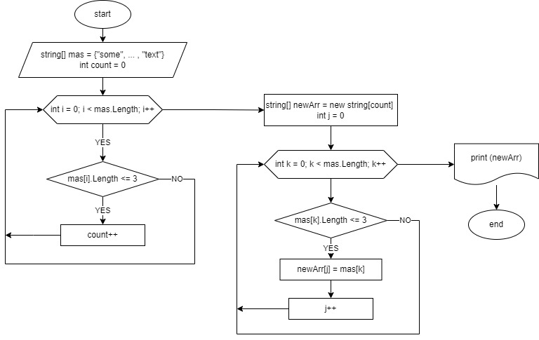
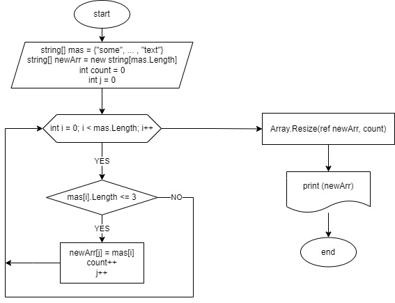

# Итоговая контрольная работа по основному блоку

## <p style="text-align: center;">План</p>
1. Создать репозиторий на GitHub
2. Нарисовать блок-схему алгоритма
3. Написать программу, решающую поставленную задачу
4. Снабдить репозиторий оформленным текстовым описанием решения (файл README.md)
5. Использовать контроль версий в работе над этим небольшим проектом

## 1. Создать репозиторий на GitHub

* Создал новый репозиторий "Final_control_work" на GitHub.
* Склонировал его в VS Code командой `git clone`.
* Добавил файл `.gitignore`.
* Создал новую консоль командой `dotnet new console`

## 2. Нарисовать блок-схему алгоритма

* Нарисовал блок-схему алгоритма решения задачи в `draw.io`
* Вариант 1. Массив задан на старте. Два цикла.

* Вариант 2. Массив задан на старте. С одним циклом и ресайзом массива.



## 3. Написать программу, решающую поставленную задачу

* Написал программу для решения поставленной задачи.
* Как я понял, динамический массив использовать нельзя, т.к. это коллекция.
* Тогда пришлось сначала считать количество слов <= 3 символа, чтобы задать размер нового массива.
* Вариант 1. Массив задан на старте. Два цикла.
```
string[] mas = {"some", "of", "the", "ways", "to", "you", "can", "now", "center", "align", "or", "any", "text"};

string[] NewArray(string[] array)
{
    // сначала считаем количество слов <= 3 символа, чтобы задать размер нового массива
    int count = 0;
    for (int i = 0; i < array.Length; i++)
    {
        if (array[i].Length <= 3) count++;
    }
    // теперь создаем новый массив нужного размера и заполняем его
    string[] newArr = new string[count];
    int j = 0;
    for (int k = 0; k < array.Length; k++)
    {
        if (array[k].Length <= 3) newArr[j++] = array[k];
    }
    return newArr;
}

Console.Write($"{String.Join(", ", NewArray(mas))}");
```
* Вариант 2. Массив задан на старте. С одним циклом и ресайзом массива.
```
string[] mas = {"some", "of", "the", "ways", "to", "you", "can", "now", "center", "align", "or", "any", "text"};

string[] NewArray(string[] array)
{
    // создаем массив такого же размера, как исходный и заполняем его элементами длиной <=3 символа
    string[] newArr = new string[array.Length];
    int count = 0;
    int j = 0;
    for (int i = 0; i < array.Length; i++)
    {
        if (array[i].Length <= 3)
        {
            newArr[j++] = array[i];
            count++; // считаем количество элементов длиной <=3 символа
        }
    }
    // уменьшаем размер массива до count
    Array.Resize(ref newArr, count);
    return newArr;
}

Console.Write($"{String.Join(", ", NewArray(mas))}");
```
* Вариант 3. Массив вводит пользователь. Один цикл и ресайз массива.
```
string[] NewArray(string[] array)
{
    // создаем массив такого же размера, как исходный и заполняем его элементами длиной <=3 символа
    string[] newArr = new string[array.Length];
    int count = 0;
    int j = 0;
    for (int i = 0; i < array.Length; i++)
    {
        if (array[i].Length <= 3)
        {
            newArr[j++] = array[i];
            count++; // считаем количество элементов длиной <=3 символа
        }
    }
    // уменьшаем размер массива до количества элементов длиной <=3 символа
    Array.Resize(ref newArr, count);
    return newArr;
}

string[] CreateStringArray()
{
    // Пользователь задает размер массива и заполняет его
    Console.Write("Введите размер массива строк: ");
    string[] arr = new string[Convert.ToInt32(Console.ReadLine())];
    for (int i = 0; i < arr.Length; i++)
    {
        Console.Write($"Введите {i + 1}-й элемент массива: ");
        arr[i] = Console.ReadLine();
    }
    Console.WriteLine("Вы ввели следующий массив строк:");
    Console.Write($"[{String.Join(", ", arr)}]");
    return arr;
}

string[] mas = CreateStringArray();
Console.WriteLine();
Console.WriteLine("Новый массив, содержащий элементы длиной <= 3 символа:");
Console.Write($"[{String.Join(", ", NewArray(mas))}]");
```

## 4. Снабдить репозиторий оформленным текстовым описанием решения

* Оформил текстовое описание в данном файле README.md

## 5. Использовать контроль версий в работе над этим небольшим проектом

* При работе над заданием использовал контроль версий, разделяя отдельные этапы работы на разные коммиты.

